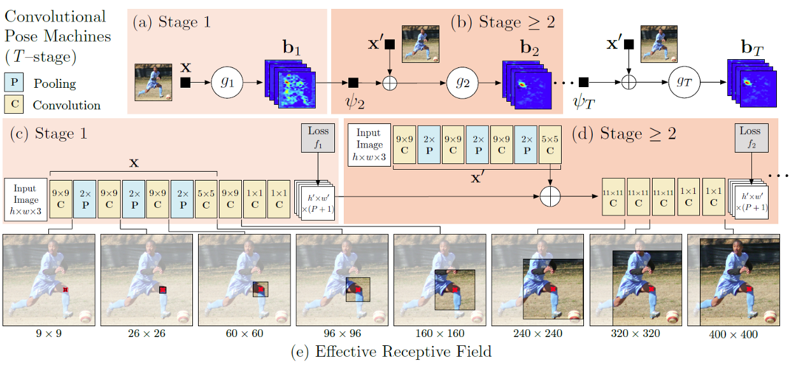
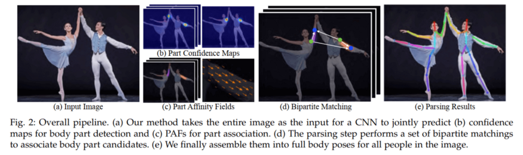

# Pose Estimation

Pose Estimation은 2D Pose Estimation, 3D Pose Estimation으로 나눌 수 있다.  2D Pose Estimation은 RGB 이미지에서 픽셀 공간의 각 관절에 대한 2D Pose(x, y)좌표를 추정한다. 3D Pose Estimation은 RGB 또는 RGB-D 이미지를 사용하여 metric space의 3D Pose(x, y, z)를 추정한다. (최근 연구는 2D 이미지, 비디오에서 3D pose 생성에 초점을 맞추고 있다.)

Pose를 추정하는 방식에는 Top-down방식과 Bottom-up방식이 있다. Top-down 방식은 영상에서 사람을 먼저 감지를 한 다음 Bounding Box 내부에서 사람의 자세를 추정하는 방식으로 문제점은 사람을 인식하지 못하면 자세 자체를 측정할 수 없고 사람의 수가 많아지면 계산량도 많아진다. Bottom-up방식은 관절 부위(key point)를 먼저 감지하여 서로 연결해 모든 사람의 자세를 추정하는 방식으로 문제점은 찾은 관절을 매칭할 수 있는 조합이 매우 많고 이를 적절하게 매칭하는데 시간이 많이 걸리며 정확도를 높이는 것도 힘들다. 하지만 사람을 먼저 감지하는 과정을 거치지 않기 때문에 Real-time에 적용이 가능하다.

## Deep Pose

Initial stage에서는 단순 초기 위치를 추정하고, 이후 단계에서는 각 관절마다 이전 위치를 중심으로 바운딩 박스를 설정하고 crop → resize, 다시 CNN regressor를 반복함으로써 각 관절의 위치를 갱신하게 된다.

### Cascade of Pose Regressors

점점 finer 해짐.

## CPM (Convolutional Pose Machine)

CPM proposed a sequential architecture that composed of convolutional networks which directly operate on belief maps from previous stages, producing increasingly refined estimates for part locations.

CPM addresses the vanishing gradients problem during training by providing a natural learning objective function that enforces intermediate supervision.

이 논문에서는 Conv 레이어를 통과한 이미지가 Receptive Field 영역으로 인해서 Local 영역만을 바라보기 때문에 관절 Belief 맵의 신뢰도가 낮게 나타나지만, Receptive Field 영역을 늘려 여러 관절간의 관계를 고려하게 함으로써 성능을 개선시키는 방법을 제안함.

1. 이미지에서 Feature Map 추출 및 1×1 Conv를 통해 초기 Belief Map 생성
2. 이미지로부터 Feature Map 추출 및 이전 단계 Belief map과 결합 후 추가적인 Conv layer를 통과하여 새로운 Belief Map 생성
3. 2번 단계를 T-1 반복 후 최종 Belief Map으로부터 관절 위치 탐색 (최대값 위치)

## OpenPose: Realtime Multi-Person 2D Pose Estimation using Part Affinity Fields

It provides a real-time method for Multi-Person 2D Pose Estimation based on its bottom-up approach instead of detection-based approach in other works

The above figure is the overall pipeline of OpenPose. There are a few steps:
1. First, the image is passed through a baseline network to extract feature maps. In the paper, the author uses the first 10 layers of VGG-19 model.  

2. Then, the feature maps are processed with **multiple stages CNN** to generate: 1) a set of Part Confidence Maps and 2) a set of Part Affinity Fields (PAFs)
3. Part Confidence Maps: a set of 2D confidence maps S for body part locations. Each joint location has a map.
4. Part Affinity Fields (PAFs): a set of 2D vector fields L which encodes the degree of association between parts.
5. Finally, the Confidence Maps and Part Affinity Fields are processed by a `greedy algorithm` to obtain the poses for each person in the image.

[link](https://towardsdatascience.com/cvpr-2017-openpose-realtime-multi-person-2d-pose-estimation-using-part-affinity-fields-f2ce18d720e8)

## Dense Pose

Densepose is a fascinating project from Facebook AI Research that establishes dense correspondences from a 2D image to a 3D, surface-based representation of the human body. Facebook research Densepose achieves dense human pose estimation, which maps all human pixels of 2D RGB images to a 3D surface based model.

In the annotation process, the human annotators establish a dense correspondence between images and a 3D surface model. First, they segment the image into 25 semantic regions ( 24 body parts+ 1 for background). Next, they sample every body part with a set of roughly equidistant points (Maximum 14 points for each part). Each part is parameterized into UV coordinates which can be seen in the following figure.

Using an FCN is easier to code and train but expecting one network to do part segmentation and pixel localization, while at the same time requiring scale-invariance is just too much. Hence we can borrow heavily from Faster R-CNN and Mask R-CNN to improve the architecture as shown.

## 1. Model Architecture

DensePose RCNN introduces improved architectures by combining the DenseReg approach with the Mask-RCNN architecture.

### 1.1. Fully convolutional Densepose Regression
- A fully convolutional network (FCN) that combines a classification and a regression task, similar to DenseReg. It performs following 2 steps:

**Classification** - Classifies each pixel to which part(I) it belongs.

**Regression** - Regresses each pixel to the corresponding 2D parameterization(U, V) to the part it belongs to

### 1.2. Region-based Dense Pose Regression

- Using FCN makes the training easy, but to load the same deep network with too many tasks, including part segmentation and pixel localization along with scale invariance becomes challenging for humans in COCO. So, they have adopted the region based approach of Mask RCNN which uses cascade of regions of interest extracting region adapted features through ROI pooling and feeds to the region specific branch.

- Hence, Mask-RCNN with the Feature Pyramid Network (FPN) features, and ROI-Align pooling provides dense part labels and coordinates within each of the selected regions. 

- On top of it, a fully convolutional network is introduced, similar to DenseReg, which combines classification and regression task as shown in the figure below. In this way, it gives per pixel IUV mapping.

I - Patch Index
U, V - 2D parameters of 3D surface

### 1.3. Multi-task cascaded architectures
- Cascading can improve performance both by providing context to the following stages, and also through the benefits of deep supervision. Here, they have also performed **Cross-cascading** architecture: The output of the
RoIAlign module in the above figure feeds into the DensePose network as well as auxiliary networks for other tasks (masks, keypoints). Once first-stage predictions are obtained from all tasks, they are combined and then fed into a second-stage refinement unit of each branch.

Now, lets look into DenseReg system how it establishes dense correspondences between 3D object model and an image in the wild.

## 2. Dense correspondence - (2D to 3D)

Each 3D object can be defined using 2D parameters UV coordinates. UV mapping is the unwrapped version of the 3D model. In order to fit a 3D template, the dense correspondence is established from the image to the 2D U-V parameterization, which can be used to identify any node on the surface.

We can visualize the bijective mapping function applied to 3D surface coordinate to 2D space as the cylindrical unwrapping. From this cylindrical unwrapping, we can interpret these coordinates as being the horizontal and vertical coordinates while moving on the surface, followed by normalization: u ∈ [0, 1] and v ∈ [0, 1].

The above image is from DenseReg paper where the mapping is used only for facial part. In DensePose, we apply same method for Head, Torso, Lower/Upper Arms, Lower/Upper Legs, Hands and Feet.